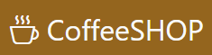

:wave:Welcome!
##### _E-Commerce of sell the coffee and accessories_ the same is a cloud-enabled, mobile-ready, offline-storage compatible, bootstrap-powered react-bootstrap vite and Markdown editor.

---
[](https://app.travis-ci.com/github/max-lpz/preEntrega-3-react)

# :electron: Main-Feature
This project form part of the course end React JS (Coderhouse)
In the same have a inicial page with all products,
and three filters by category and an cart icon.
after to filter a wish product, you can select the quantity and a button for add and other button for cancel the same.
When you add a product, are added to "LocalStorage" and When buy products are added to data bases (Firebase).
As long as they have stock, otherwise be are notification with a notification in color red, without stock

    # Components:
    
    * ItemListContainer(This component can be view all products (catalogue))
        -ItemList(Each producto with your Photo, name and description)
        -Item
        
    * ItemDetailContainer(Product)
        -ItemDetail(Detail of each producto with your Photo, name, description, price and stock)
        -ItemCount (Button add & Button Cancel)
        
    * CartView(Section of added products)
        -CartItem(Summary of each productos with their cost and total amount)
        
    * Checkout(Last section where the buyer view your buy finish and message of thanks)

# Tech
:desktop_computer: CoffeeSHOP uses a number of open source projects to work properly:
- [bootstrap] - CSS enhanced for web apps!
- [reactJS] - awesome web-based text editor
- [markdown-it] - Markdown parser done right. Fast and easy to extend.
- [node.js] - evented I/O for the backend

And of course CoffeeSHOP itself is open source with a public repository: https://github.com/max-lpz/preEntrega-3-react on GitHub

---
## :gear: Installation

CoffeeSHOP requires:
    [Node.js](https://nodejs.org/)
    [Vite.js](https://vitejs.dev/) with [React](https://vitejs.dev/)
    [React Bootstrap](https://react-bootstrap.netlify.app/)

Install the dependencies and devDependencies and start the server.

```sh
clone proyect in a folder in your pc
cd preEntrega-3-react
npm i
```

## :unlock: License
Free - OpenSource

